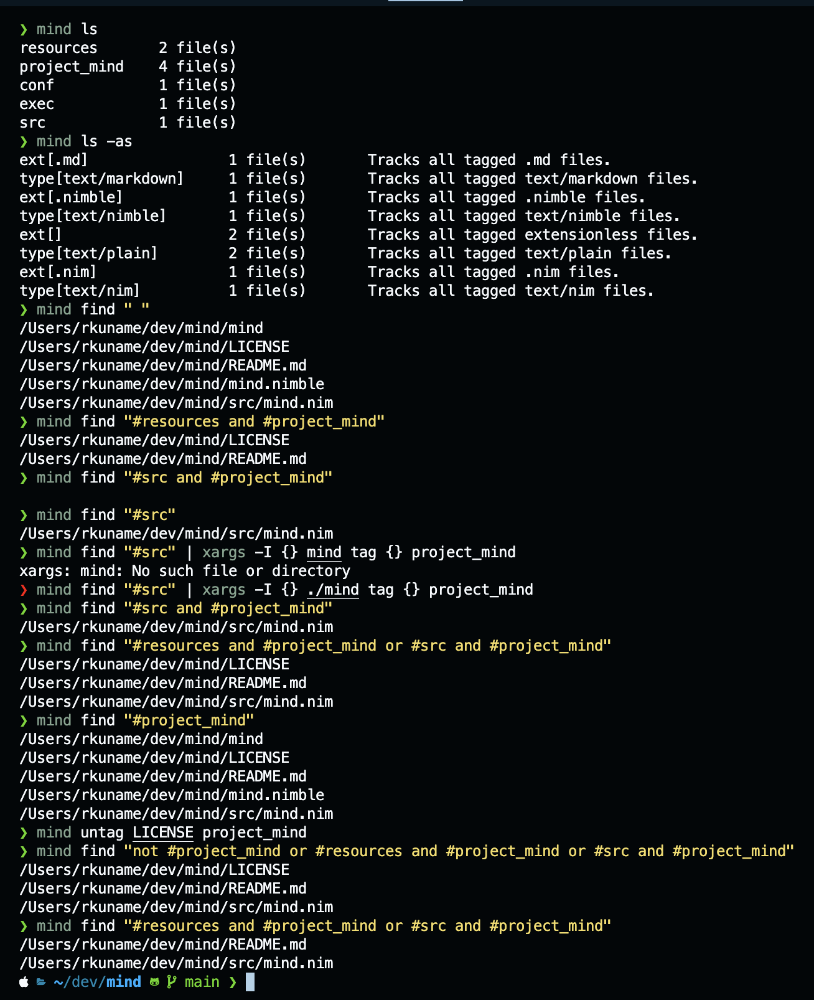

# Mind - (WIP)
Mind - *tags for the sane*. A NIMble and efficient tag-based system for file and content management.

With a focus on simplicity, **Mind** allows users to effortlessley exploit the tagging system to create multiple layouts and structures (think quick semantic lookups, or even KANBAN for your terminal). All due to tags and a powerful boolean-based lookup DSL.

### Usage example

### TODOs

- [x] Files and Tags logic
- [x] Make all removals deep for hard files
- [x] ~~Add hash/checksums support for duplicates detection~~ (replaced with `dev_t` & `ino_t` checks)
- [x] Synchronise sym links
- [x] Full Lookup DSL
- [ ] Memos support :memo:
- [ ] Tasks and TODO lists :white_check_mark:
- [ ] Key-value store :key: (with optional encryption :lock:)
- [ ] Backups (compression and auto-backups)
- [ ] Full error-handling + code and usage documentation
- [ ] Optimization time / ORM-less, Cascade deletes? :thinking_face: (maybe SQL-less even)
- [ ] Some CLI visual work (maybe some zsh completions)
- [ ] Testing :tired_face:
- [ ] Behaviour configuration and defaults
- [ ] AI-backend for multi-modal content auto-tagging
